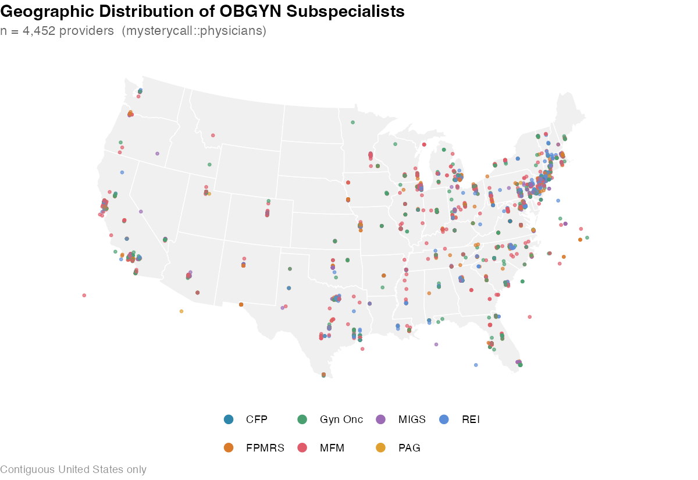
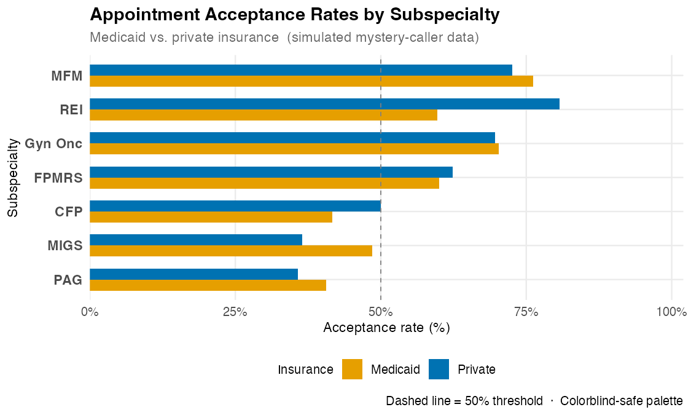
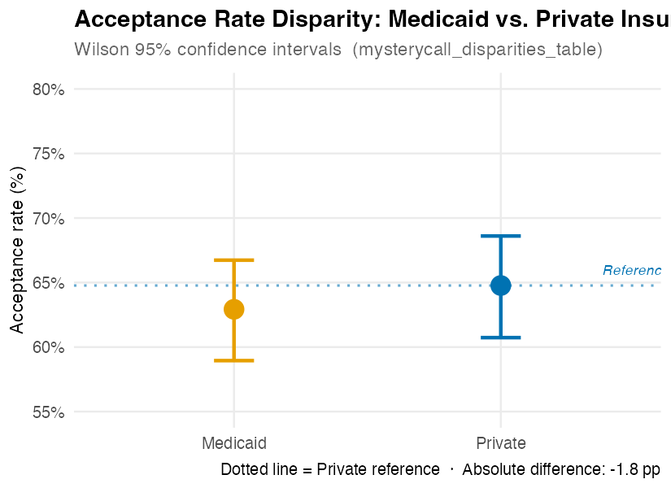
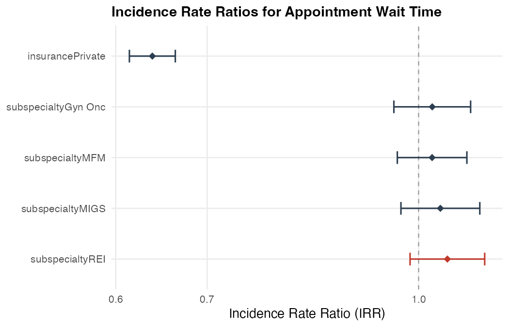
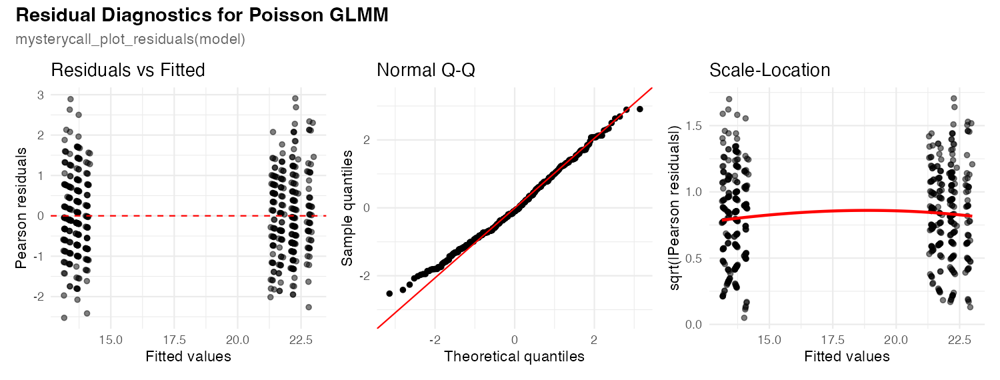

# mysterycall

<!-- badges: start -->


[](https://www.repostatus.org/#active)
[](https://lifecycle.r-lib.org/articles/stages.html#maturing)
[](https://app.codecov.io/gh/mufflyt/mysterycall?branch=main)
[](https://CRAN.R-project.org/package=mysterycall)
[](https://github.com/mufflyt/mysterycall/actions/workflows/R-CMD-check.yaml)
<!-- badges: end -->

**mysterycall** provides a toolkit for mystery caller and audit studies that evaluate
patient access to healthcare. It handles the full workflow: finding providers
in the NPI registry, validating and geocoding their addresses, generating
drive-time isochrones, overlaying Census demographics, and producing publication-ready
tables and maps.

## Installation

```r
# install.packages("pak")
pak::pkg_install("mufflyt/mysterycall")
```

The package loads quickly. Geospatial and modelling packages are optional and
loaded only when first needed:

```r
install.packages(c("hereR", "sf", "lwgeom"))  # drive-time isochrones
install.packages("leaflet")                            # interactive maps
install.packages("ggmap")                              # Google Maps geocoding
install.packages(c("ggspatial", "rnaturalearth"))      # HRR hex maps
install.packages("lme4")                               # mixed-effects models
install.packages("censusapi")                          # Census block-group data
```

## Quick start

A typical mystery caller study moves through four stages:

```r
library(mysterycall)
library(dplyr)

# ── 1. Build a provider roster ────────────────────────────────────────────────

# Search by taxonomy across all 50 states (bypasses the 1,200-record API cap)
all_states <- c(
  "AL","AK","AZ","AR","CA","CO","CT","DE","FL","GA","HI","ID","IL","IN",
  "IA","KS","KY","LA","ME","MD","MA","MI","MN","MS","MO","MT","NE","NV",
  "NH","NJ","NM","NY","NC","ND","OH","OK","OR","PA","RI","SC","SD","TN",
  "TX","UT","VT","VA","WA","WV","WI","WY"
)

gyn_onc <- mysterycall_search_taxonomy("Gynecologic Oncology", states = all_states)

# Validate NPI numbers before downstream lookups
gyn_onc_valid <- mysterycall_validate_npi(gyn_onc)

# Enrich with CMS Physician Compare demographics
gyn_onc_enriched <- mysterycall_get_clinician_data(gyn_onc_valid)

# ── 2. Geocode ────────────────────────────────────────────────────────────────

# Requires a Google Maps API key in GOOGLE_API_KEY env var
geocoded <- mysterycall_geocode(
  gyn_onc_enriched,
  google_maps_api_key = Sys.getenv("GOOGLE_API_KEY")
)

# ── 3. Drive-time isochrones ──────────────────────────────────────────────────

# Requires a routing API key in HERE_API_KEY env var
isochrones <- mysterycall_isochrones_for_df(
  geocoded,
  breaks = c(1800, 3600, 7200, 10800)   # 30 / 60 / 120 / 180 min
)

# Free the in-memory isochrone cache after a large batch
mysterycall_clear_isochrone_cache()

# ── 4. Map ────────────────────────────────────────────────────────────────────

mysterycall_map_physicians(geocoded, popup_var = "name")
```

## Gallery

<table>
<tr>
<td width="50%">

**Provider roster** — subspecialist counts from the built-in `physicians` dataset
(`mysterycall_search_taxonomy`)


</td>
<td width="50%">

**Geographic distribution** — dot map of 4,659 OBGYN subspecialists across the US
(`mysterycall_map_physicians`)



</td>
</tr>
<tr>
<td width="50%">

**Acceptance rates** — Medicaid vs. private insurance by subspecialty
(`mysterycall_plot_stacked_bar`)



</td>
<td width="50%">

**Insurance disparity** — Wilson 95% CIs by insurance type
(`mysterycall_disparities_table`)



</td>
</tr>
<tr>
<td width="50%">

**Choropleth map** — appointment acceptance rate by state
(`mysterycall_map_acceptance_rate`)


</td>
<td width="50%">

**Wait-time distribution** — overlapping densities with group medians
(`mysterycall_plot_density`)


</td>
</tr>
<tr>
<td width="50%">

**IRR forest plot** — incidence rate ratios from a Poisson GLMM
(`mysterycall_irr_plot`)



</td>
<td width="50%">

**Power curve** — providers per arm needed to detect a given IRR
(`mysterycall_equation_figure`)


</td>
</tr>
<tr>
<td width="50%">

**CONSORT flowchart** — sequential inclusion/exclusion for audit studies
(`mysterycall_flowchart`)


</td>
<td width="50%">

**Residual diagnostics** — three-panel model check for Poisson GLMM fit
(`mysterycall_plot_residuals`)



</td>
</tr>
</table>

## Core functions

| Stage | Function | Description |
|---|---|---|
| **Find providers** | `mysterycall_search_taxonomy()` | NPI search by taxonomy; loops over states to bypass the 1,200-record cap |
| | `mysterycall_search_and_process_npi()` | NPI search by first/last name |
| | `mysterycall_validate_npi()` | Remove invalid NPI numbers before enrichment |
| | `mysterycall_get_clinician_data()` | Pull demographics from CMS Physician Compare |
| | `mysterycall_genderize()` | Estimate physician gender via the Genderize.io API |
| **Geocode** | `mysterycall_geocode()` | Convert addresses to lat/lon via Google Maps |
| **Isochrones** | `mysterycall_isochrones_for_df()` | Drive-time polygons for every row using a drive-time routing service |
| | `mysterycall_create_isochrones()` | Single-location drive-time polygon |
| | `mysterycall_clear_isochrone_cache()` | Release the in-session memoization cache |
| **Census** | `mysterycall_get_census_data()` | ACS block-group demographics by state FIPS |
| | `mysterycall_calculate_overlap()` | Overlap area between isochrones and block groups |
| **Maps** | `mysterycall_map_physicians()` | Interactive Leaflet dot map coloured by ACOG district |
| | `mysterycall_map_block_group()` | Block-group overlap map exported to HTML + PNG |
| | `mysterycall_hrr_maps()` | Hexagon density map by Hospital Referral Region |
| **Tables** | `mysterycall_table_overall()` | Table 1 summary (via `arsenal`) |
| | `mysterycall_table_percentages()` | Column-percentage tables |

## Built-in datasets

| Dataset | Description |
|---|---|
| `taxonomy` | NUCC taxonomy codes (v23.1) for all OBGYN subspecialties |
| `ACOG_Districts` | State → ACOG district + Census subregion crosswalk |
| `acgme` | All 318 ACGME-accredited OBGYN residency programs |
| `physicians` | Sample roster of 4,659 OBGYN subspecialists with coordinates |
| `fips` | State FIPS codes and abbreviations |
| `cityStateToLatLong` | City/state → lat/lon lookup table |
| `acog_presidents` | Historical ACOG presidents data |
| `census_summaries` | Pre-computed Census block-group demographics |

```r
# Example: find all OBGYN taxonomy codes
library(mysterycall)
library(dplyr)
library(stringr)

taxonomy |>
  filter(str_detect(Classification, fixed("GYN", ignore_case = TRUE))) |>
  select(Code, Specialization)
#> # A tibble: 11 × 2
#>    Code       Specialization
#>    <chr>      <chr>
#>  1 207V00000X Obstetrics & Gynecology
#>  2 207VF0040X Female Pelvic Medicine and Reconstructive Surgery
#>  3 207VX0201X Gynecologic Oncology
#>  4 207VM0101X Maternal & Fetal Medicine
#>  5 207VE0102X Reproductive Endocrinology
#>  ...
```

## Learn more

Full documentation, function reference, and worked vignettes:
**<https://mufflyt.github.io/mysterycall/>**

- [Create Isochrones](https://mufflyt.github.io/mysterycall/articles/create_isochrones.html)
- [Get Census Data](https://mufflyt.github.io/mysterycall/articles/get_census_data.html)
- [Geocoding](https://mufflyt.github.io/mysterycall/articles/geocode.html)
- [Search & Process NPI](https://mufflyt.github.io/mysterycall/articles/search_and_process_npi.html)
- [Aggregating Provider Data](https://mufflyt.github.io/mysterycall/articles/aggregating_provider_data.html)

## Citing mysterycall

```r
citation("mysterycall")
```

> Muffly, T. (2026). *mysterycall: Mystery Caller Study Tools for Healthcare
> Access Research* (R package version 1.3.0).
> <https://github.com/mufflyt/mysterycall>

## Code of conduct

Please note that this project is released with a
[Contributor Code of Conduct](CODE_OF_CONDUCT.md). By participating you agree
to abide by its terms.
