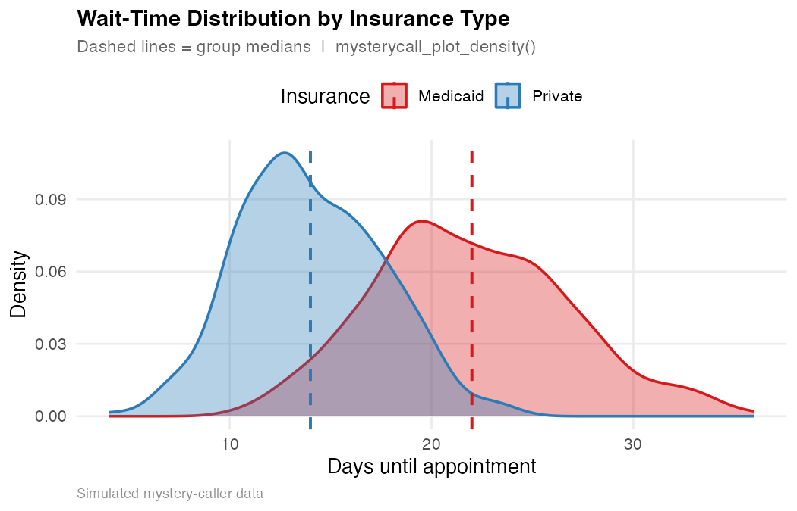
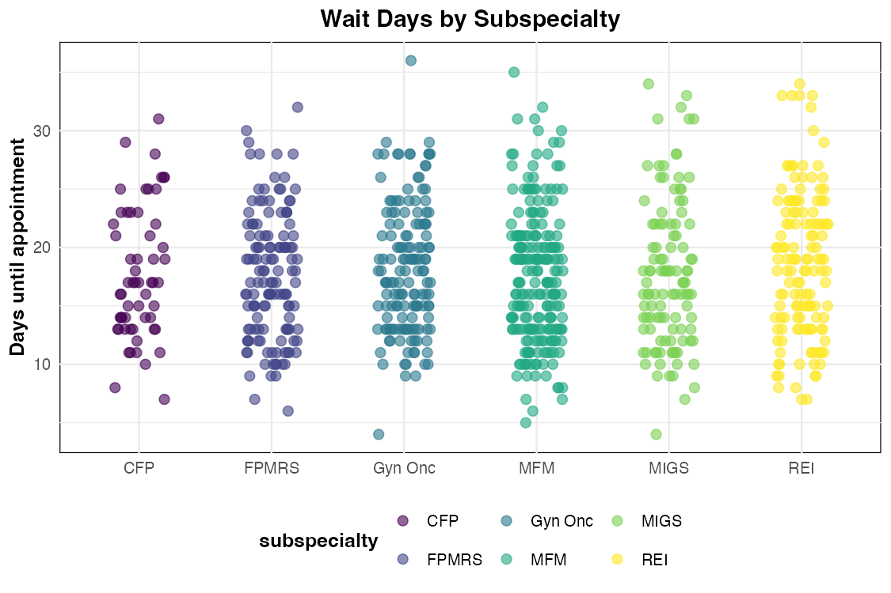
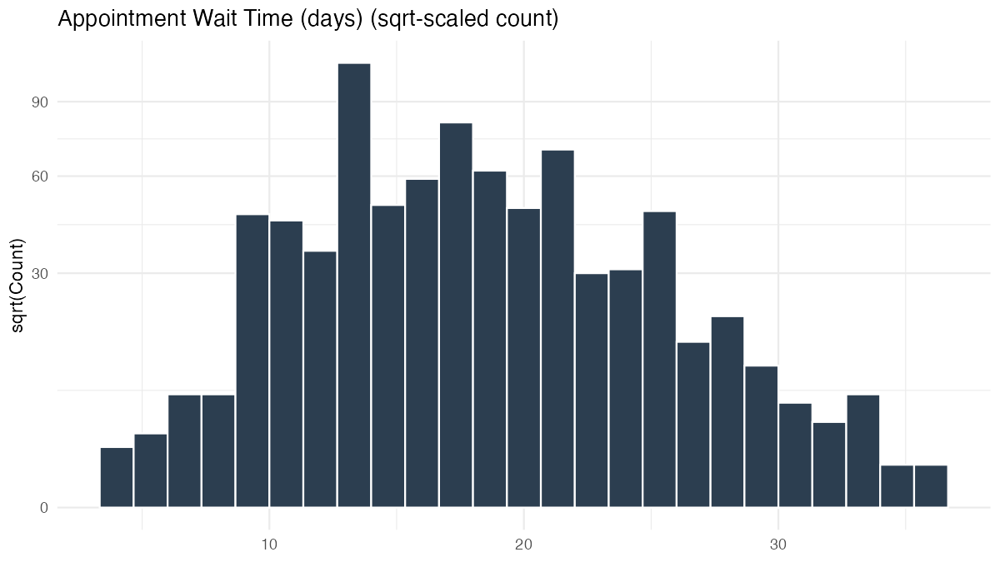
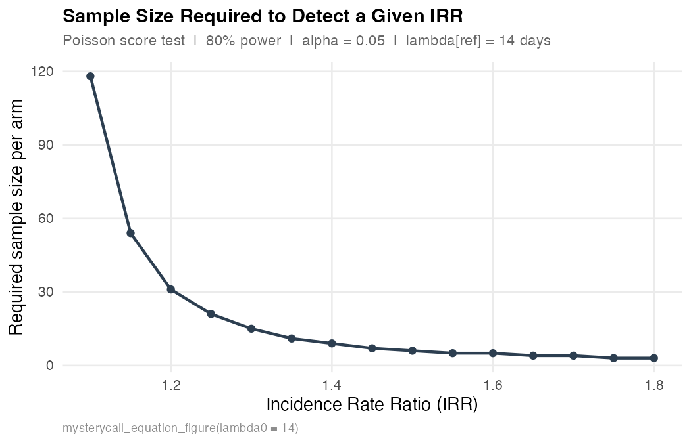
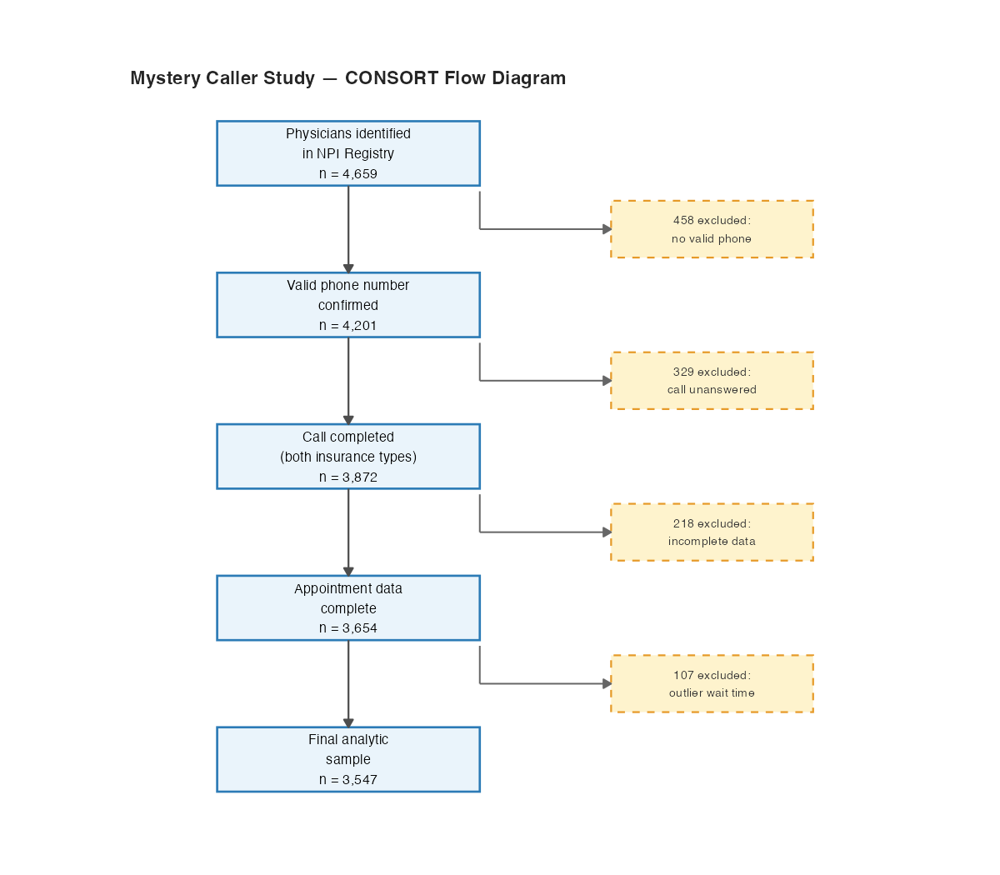

v1.3.0  ·  R package

End-to-end toolkit for mystery caller and audit studies evaluating
patient access to healthcare — from NPI roster building to drive-time
isochrones, Census demographics, and publication-ready maps and tables.

[Function
reference](https://mufflyt.github.io/mysterycall/reference/index.md)
[Vignettes](https://mufflyt.github.io/mysterycall/articles/index.md)
[GitHub](https://github.com/mufflyt/mysterycall)

\# Install from GitHub  
pak::pkg_install("mufflyt/mysterycall")  
  
\# Optional geospatial/modelling packages (loaded on demand)  
install.packages(c("hereR", "sf", "leaflet", "censusapi", "lme4"))

Four-stage workflow

1

#### Build roster

Search the NPI registry by taxonomy across all 50 states, bypass the
1,200-record API cap, and enrich with CMS demographics.

2

#### Geocode

Convert provider addresses to lat/lon via the Google Maps API,
deduplicating so each unique address is only looked up once.

3

#### Drive-time isochrones

Generate drive-time polygons (30 / 60 / 120 / 180 min) using the
drive-time routing service, with built-in memoization for large batches.

4

#### Analyse & report

Overlay Census block-group demographics, compute overlap areas, and
produce Leaflet maps and `arsenal` summary tables.

Key functions

🔍

#### Provider search

[`mysterycall_search_taxonomy()`](https://mufflyt.github.io/mysterycall/reference/mysterycall_search_taxonomy.md)  
[`mysterycall_search_and_process_npi()`](https://mufflyt.github.io/mysterycall/reference/mysterycall_search_and_process_npi.md)  
[`mysterycall_validate_npi()`](https://mufflyt.github.io/mysterycall/reference/mysterycall_validate_npi.md)  
[`mysterycall_get_clinician_data()`](https://mufflyt.github.io/mysterycall/reference/mysterycall_get_clinician_data.md)

📍

#### Geocoding & isochrones

[`mysterycall_geocode()`](https://mufflyt.github.io/mysterycall/reference/mysterycall_geocode.md)  
[`mysterycall_isochrones_for_df()`](https://mufflyt.github.io/mysterycall/reference/mysterycall_isochrones_for_df.md)  
[`mysterycall_create_isochrones()`](https://mufflyt.github.io/mysterycall/reference/mysterycall_create_isochrones.md)  
[`mysterycall_clear_isochrone_cache()`](https://mufflyt.github.io/mysterycall/reference/mysterycall_clear_isochrone_cache.md)

🗺️

#### Mapping

[`mysterycall_map_physicians()`](https://mufflyt.github.io/mysterycall/reference/mysterycall_map_physicians.md)  
[`mysterycall_map_block_group()`](https://mufflyt.github.io/mysterycall/reference/mysterycall_map_block_group.md)  
[`mysterycall_map_acog_districts()`](https://mufflyt.github.io/mysterycall/reference/mysterycall_map_acog_districts.md)  
[`mysterycall_hrr_maps()`](https://mufflyt.github.io/mysterycall/reference/mysterycall_hrr_maps.md)

📊

#### Census & tables

[`mysterycall_get_census_data()`](https://mufflyt.github.io/mysterycall/reference/mysterycall_get_census_data.md)  
[`mysterycall_calculate_overlap()`](https://mufflyt.github.io/mysterycall/reference/mysterycall_calculate_overlap.md)  
[`mysterycall_table_overall()`](https://mufflyt.github.io/mysterycall/reference/mysterycall_table_overall.md)  
[`mysterycall_table_percentages()`](https://mufflyt.github.io/mysterycall/reference/mysterycall_table_percentages.md)

Example figures

**Provider roster** — subspecialist counts from `physicians`
(`mysterycall_search_taxonomy`)


**Geographic distribution** — dot map of 4,659 providers across the US
(`mysterycall_map_physicians`)


**100% stacked bar** — acceptance vs. rejection with call counts
(`mysterycall_plot_stacked_bar`)


**Acceptance rates** — Medicaid vs. private insurance by subspecialty
(`mysterycall_map_acceptance_rate`)


**Choropleth map** — acceptance rate by state
(`mysterycall_map_acceptance_rate`)


**Insurance disparity** — Wilson 95% CIs by insurance type
(`mysterycall_disparities_table`)


**IRR forest plot** — incidence rate ratios from a Poisson GLMM
(`mysterycall_irr_plot`)


**Estimated marginal means** — Medicaid vs. private wait days by
subspecialty (`mysterycall_plot_emmeans_interaction`)


**Wait-time density** — overlapping distributions with group medians
(`mysterycall_plot_density`)



**Jittered scatter** — raw wait-day observations by subspecialty
(`mysterycall_plot_scatter`)



**Wait-time histogram** — sqrt-scaled count distribution
(`mysterycall_plot_distribution`)



**Power curve** — providers per arm needed to detect a given IRR
(`mysterycall_equation_figure`)



**CONSORT flowchart** — sequential inclusion/exclusion diagram
(`mysterycall_flowchart`)



**Residual diagnostics** — three-panel model check for Poisson GLMM
(`mysterycall_plot_residuals`)


Built-in datasets

| Dataset | Description | Rows |
|----|----|----|
| `taxonomy` | NUCC taxonomy codes (v23.1) for OBGYN subspecialties | ~900 |
| `ACOG_Districts` | State → ACOG district + Census subregion crosswalk | 51 |
| `acgme` | All 318 ACGME-accredited OBGYN residency programs | 318 |
| `physicians` | Sample roster of OBGYN subspecialists with coordinates | 4,659 |
| `fips` | State FIPS codes and abbreviations | 51 |
| `acog_presidents` | Historical ACOG presidents | — |
| `census_summaries` | Pre-computed Census block-group demographics | — |

Learn more

| Vignette | Topic |
|----|----|
| [Create Isochrones](https://mufflyt.github.io/mysterycall/articles/create_isochrones.md) | Drive-time polygons from geocoded addresses |
| [Geocoding](https://mufflyt.github.io/mysterycall/articles/geocode.md) | Address → lat/lon with Google Maps |
| [Get Census Data](https://mufflyt.github.io/mysterycall/articles/get_census_data.md) | ACS block-group demographics |
| [Search & Process NPI](https://mufflyt.github.io/mysterycall/articles/search_and_process_npi.md) | Name-based provider lookup |
| [Aggregating Provider Data](https://mufflyt.github.io/mysterycall/articles/aggregating_provider_data.md) | Combining taxonomy + NPI data |
| [News & Changelog](https://mufflyt.github.io/mysterycall/articles/imotive-news.md) | Release notes |

Citation

``` r

citation("mysterycall")
```

> Muffly, T. (2026). *mysterycall: Mystery Caller Study Tools for
> Healthcare Access Research* (R package version 1.3.0).
> <https://github.com/mufflyt/mysterycall>
