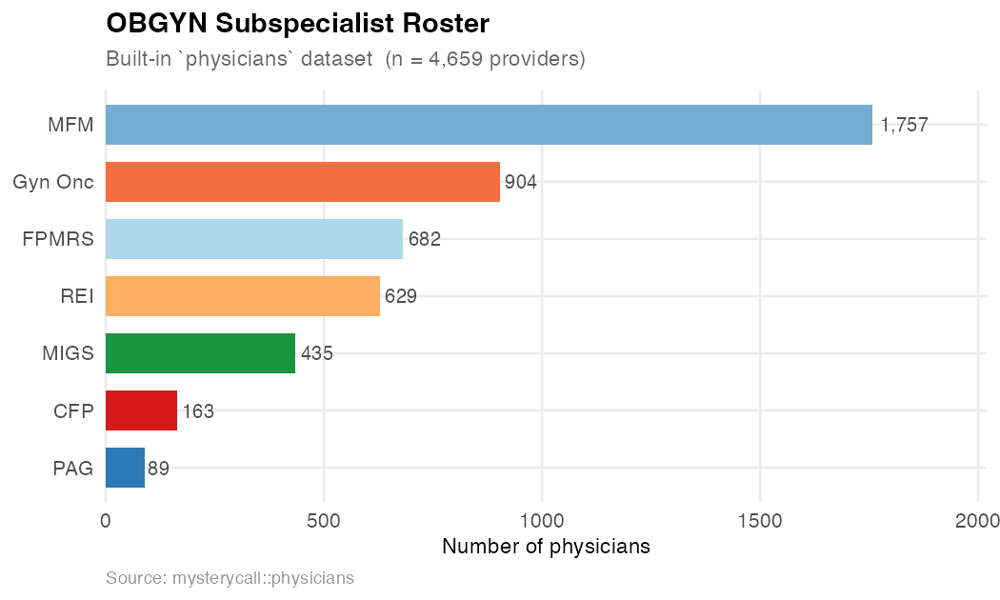
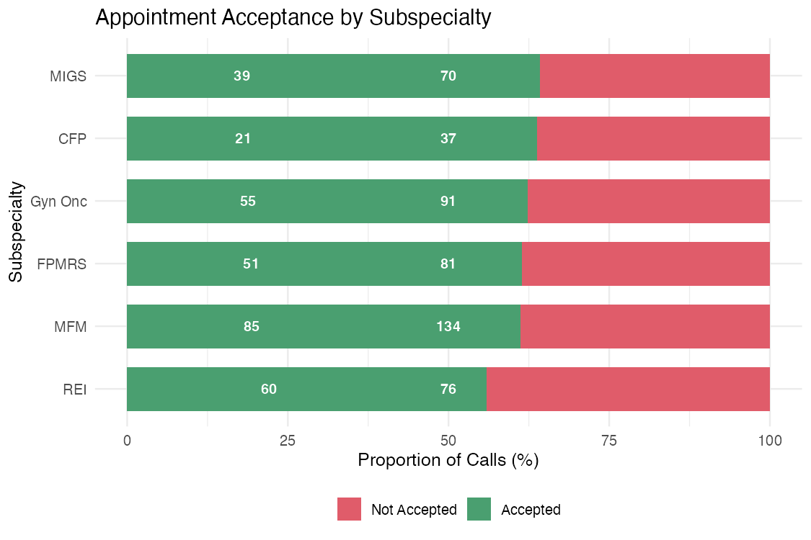
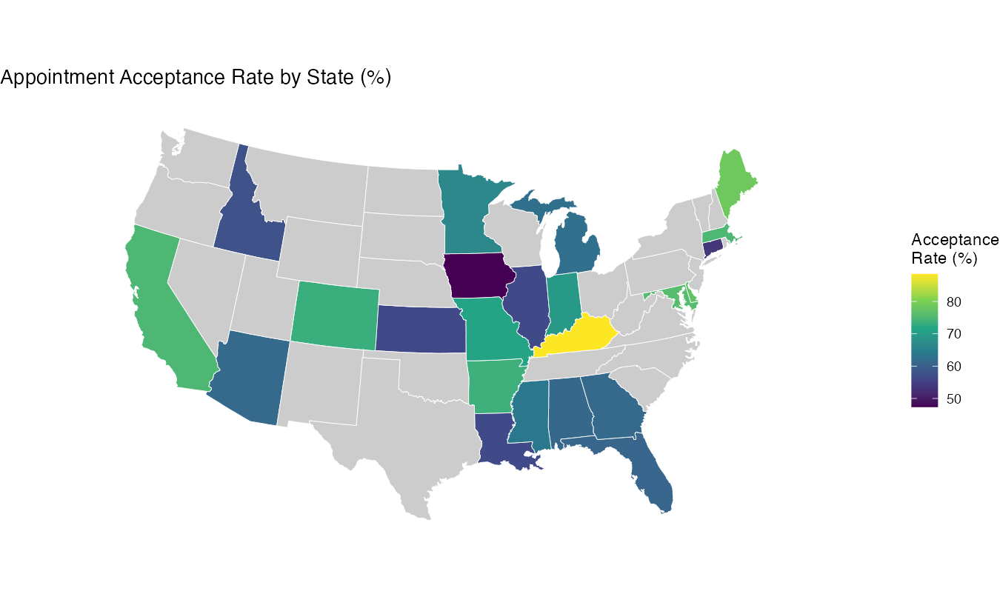
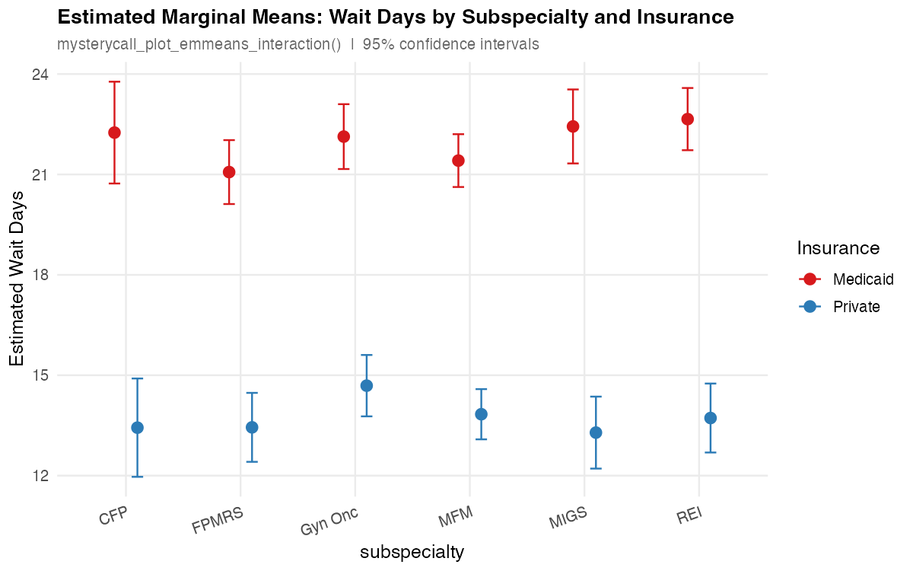

```{=html}
<!-- Hero -->
<div class="mc-hero">
  <h1>mysterycall</h1>
  <div class="mc-version">v1.3.0 &nbsp;·&nbsp; R package</div>
  <p class="lead">
    End-to-end toolkit for mystery caller and audit studies evaluating
    patient access to healthcare — from NPI roster building to drive-time
    isochrones, Census demographics, and publication-ready maps and tables.
  </p>
  <a class="mc-btn mc-btn-primary"  href="reference/index.html">Function reference</a>
  <a class="mc-btn mc-btn-secondary" href="articles/index.html">Vignettes</a>
  <a class="mc-btn mc-btn-secondary" href="https://github.com/mufflyt/mysterycall">GitHub</a>
</div>
```

```{=html}
<div class="mc-install">
<span class="mc-comment"># Install from GitHub</span><br>
pak::pkg_install("mufflyt/mysterycall")<br><br>
<span class="mc-comment"># Optional geospatial/modelling packages (loaded on demand)</span><br>
install.packages(c("hereR", "sf", "leaflet", "censusapi", "lme4"))
</div>
```

```{=html}
<p class="mc-section-title">Four-stage workflow</p>

<div class="mc-steps">

  <div class="mc-step">
    <div class="mc-step-num">1</div>
    <h4>Build roster</h4>
    <p>Search the NPI registry by taxonomy across all 50 states, bypass the
       1,200-record API cap, and enrich with CMS demographics.</p>
  </div>

  <div class="mc-step">
    <div class="mc-step-num">2</div>
    <h4>Geocode</h4>
    <p>Convert provider addresses to lat/lon via the Google Maps API,
       deduplicating so each unique address is only looked up once.</p>
  </div>

  <div class="mc-step">
    <div class="mc-step-num">3</div>
    <h4>Drive-time isochrones</h4>
    <p>Generate drive-time polygons (30 / 60 / 120 / 180 min) using the
       drive-time routing service, with built-in memoization for large batches.</p>
  </div>

  <div class="mc-step">
    <div class="mc-step-num">4</div>
    <h4>Analyse &amp; report</h4>
    <p>Overlay Census block-group demographics, compute overlap areas,
       and produce Leaflet maps and <code>arsenal</code> summary tables.</p>
  </div>

</div>
```

```{=html}
<p class="mc-section-title">Key functions</p>

<div class="mc-cards">

  <div class="mc-card">
    <div class="mc-card-icon">🔍</div>
    <h4>Provider search</h4>
    <p><code>mysterycall_search_taxonomy()</code><br>
       <code>mysterycall_search_and_process_npi()</code><br>
       <code>mysterycall_validate_npi()</code><br>
       <code>mysterycall_get_clinician_data()</code></p>
  </div>

  <div class="mc-card">
    <div class="mc-card-icon">📍</div>
    <h4>Geocoding &amp; isochrones</h4>
    <p><code>mysterycall_geocode()</code><br>
       <code>mysterycall_isochrones_for_df()</code><br>
       <code>mysterycall_create_isochrones()</code><br>
       <code>mysterycall_clear_isochrone_cache()</code></p>
  </div>

  <div class="mc-card">
    <div class="mc-card-icon">🗺️</div>
    <h4>Mapping</h4>
    <p><code>mysterycall_map_physicians()</code><br>
       <code>mysterycall_map_block_group()</code><br>
       <code>mysterycall_map_acog_districts()</code><br>
       <code>mysterycall_hrr_maps()</code></p>
  </div>

  <div class="mc-card">
    <div class="mc-card-icon">📊</div>
    <h4>Census &amp; tables</h4>
    <p><code>mysterycall_get_census_data()</code><br>
       <code>mysterycall_calculate_overlap()</code><br>
       <code>mysterycall_table_overall()</code><br>
       <code>mysterycall_table_percentages()</code></p>
  </div>

</div>
```

```{=html}
<p class="mc-section-title">Example figures</p>

<div class="mc-gallery">

  <div class="mc-gallery-item">
    
    <div class="mc-gallery-body">
      <p class="mc-gallery-caption"><strong>Provider roster</strong> — subspecialist counts from the built-in <code>physicians</code> dataset</p>
      <pre class="mc-gallery-code">library(mysterycall)

# Search NPI registry by taxonomy
providers &lt;- mysterycall_search_taxonomy(
  "Gynecologic Oncology",
  states = c("CA", "TX", "NY", "FL")
)

# Built-in dataset has 4,659 providers
count(physicians, subspecialty)</pre>
    </div>
  </div>

  <div class="mc-gallery-item">
    
    <div class="mc-gallery-body">
      <p class="mc-gallery-caption"><strong>Geographic distribution</strong> — dot map of providers coloured by subspecialty</p>
      <pre class="mc-gallery-code"># physicians dataset includes lat/long
mysterycall_map_physicians(
  physicians,
  popup_var = "name"
)</pre>
    </div>
  </div>

  <div class="mc-gallery-item">
    
    <div class="mc-gallery-body">
      <p class="mc-gallery-caption"><strong>100% stacked bar</strong> — acceptance vs. rejection proportions with call counts</p>
      <pre class="mc-gallery-code">mysterycall_plot_stacked_bar(
  data          = call_data,
  outcome_col   = "accepted",
  group_col     = "subspecialty",
  fill_labels   = c("Not Accepted", "Accepted"),
  order_by_rate = TRUE
)</pre>
    </div>
  </div>

  <div class="mc-gallery-item">
    
    <div class="mc-gallery-body">
      <p class="mc-gallery-caption"><strong>Acceptance rates</strong> — Medicaid vs. private insurance by subspecialty</p>
      <pre class="mc-gallery-code">call_data |&gt;
  group_by(subspecialty, insurance) |&gt;
  summarise(rate = mean(accepted)) |&gt;
  ggplot(aes(subspecialty, rate * 100,
             fill = insurance)) +
  geom_col(position = "dodge") +
  coord_flip()</pre>
    </div>
  </div>

  <div class="mc-gallery-item">
    
    <div class="mc-gallery-body">
      <p class="mc-gallery-caption"><strong>Choropleth map</strong> — appointment acceptance rate by state</p>
      <pre class="mc-gallery-code">state_rates &lt;- call_data |&gt;
  group_by(state) |&gt;
  summarise(rate = mean(accepted))

mysterycall_map_acceptance_rate(
  state_rates,
  region_col = "state",
  rate_col   = "rate",
  palette    = "viridis"
)</pre>
    </div>
  </div>

  <div class="mc-gallery-item">
    
    <div class="mc-gallery-body">
      <p class="mc-gallery-caption"><strong>Insurance disparity</strong> — Wilson 95% CIs via <code>mysterycall_disparities_table</code></p>
      <pre class="mc-gallery-code">disp &lt;- mysterycall_disparities_table(
  call_data,
  outcome_col = "accepted",
  group_col   = "insurance",
  ref_group   = "Private",
  ci_method   = "wilson"
)
print(disp)</pre>
    </div>
  </div>

  <div class="mc-gallery-item">
    
    <div class="mc-gallery-body">
      <p class="mc-gallery-caption"><strong>IRR forest plot</strong> — incidence rate ratios from a Poisson GLMM</p>
      <pre class="mc-gallery-code">model &lt;- mysterycall_poisson_model(
  call_data,
  outcome       = "wait_days",
  predictors    = c("insurance", "subspecialty"),
  random_effect = "physician"
)
mysterycall_irr_plot(model, x_log = TRUE)</pre>
    </div>
  </div>

  <div class="mc-gallery-item">
    
    <div class="mc-gallery-body">
      <p class="mc-gallery-caption"><strong>Estimated marginal means</strong> — Medicaid vs. private wait days by subspecialty</p>
      <pre class="mc-gallery-code">m &lt;- lm(
  wait_days ~ insurance * subspecialty,
  data = call_data
)
mysterycall_plot_emmeans_interaction(
  model    = m,
  specs    = c("subspecialty", "insurance"),
  variable = "Estimated Wait Days"
)</pre>
    </div>
  </div>

  <div class="mc-gallery-item">
    
    <div class="mc-gallery-body">
      <p class="mc-gallery-caption"><strong>Wait-time density</strong> — overlapping distributions with group medians</p>
      <pre class="mc-gallery-code">mysterycall_plot_density(
  data       = call_data,
  x_var      = "wait_days",
  fill_var   = "insurance",
  plot_title = "Days Until Appointment",
  output_dir = NULL
)</pre>
    </div>
  </div>

  <div class="mc-gallery-item">
    
    <div class="mc-gallery-body">
      <p class="mc-gallery-caption"><strong>Jittered scatter</strong> — raw wait-day observations by subspecialty</p>
      <pre class="mc-gallery-code">mysterycall_plot_scatter(
  plot_data  = call_data,
  x_var      = "subspecialty",
  y_var      = "wait_days",
  output_dir = NULL,
  verbose    = FALSE
)</pre>
    </div>
  </div>

  <div class="mc-gallery-item">
    
    <div class="mc-gallery-body">
      <p class="mc-gallery-caption"><strong>Wait-time histogram</strong> — sqrt-scaled count distribution</p>
      <pre class="mc-gallery-code">mysterycall_plot_distribution(
  x     = call_data$wait_days,
  title = "Appointment Wait Time (days)",
  bins  = 25L
)</pre>
    </div>
  </div>

  <div class="mc-gallery-item">
    
    <div class="mc-gallery-body">
      <p class="mc-gallery-caption"><strong>Power curve</strong> — providers per arm needed to detect a given IRR</p>
      <pre class="mc-gallery-code">mysterycall_equation_figure(
  lambda0   = 14,        # baseline wait (days)
  irr_seq   = seq(1.1, 1.8, by = 0.05),
  power     = 0.80,
  both_arms = TRUE
)</pre>
    </div>
  </div>

  <div class="mc-gallery-item">
    
    <div class="mc-gallery-body">
      <p class="mc-gallery-caption"><strong>CONSORT flowchart</strong> — sequential inclusion/exclusion for audit studies</p>
      <pre class="mc-gallery-code">mysterycall_flowchart(
  steps = c(
    "NPI Registry"     = "4,659",
    "Valid phone"      = "4,201",
    "Call completed"   = "3,872",
    "Final sample"     = "3,547"
  ),
  exclusions = c(
    "Valid phone"    = "458: no valid phone",
    "Call completed" = "329: unanswered",
    "Final sample"   = "325: incomplete data"
  )
)</pre>
    </div>
  </div>

  <div class="mc-gallery-item">
    
    <div class="mc-gallery-body">
      <p class="mc-gallery-caption"><strong>Residual diagnostics</strong> — three-panel model check for Poisson GLMM fit</p>
      <pre class="mc-gallery-code">model &lt;- mysterycall_poisson_model(
  call_data,
  outcome       = "wait_days",
  predictors    = c("insurance", "subspecialty"),
  random_effect = "physician"
)
mysterycall_plot_residuals(model)</pre>
    </div>
  </div>

</div>
```

```{=html}
<p class="mc-section-title">Built-in datasets</p>

<table class="table mc-datasets">
<thead><tr>
  <th>Dataset</th><th>Description</th><th>Rows</th>
</tr></thead>
<tbody>
<tr><td><code>taxonomy</code></td>
    <td>NUCC taxonomy codes (v23.1) for OBGYN subspecialties</td><td>~900</td></tr>
<tr><td><code>ACOG_Districts</code></td>
    <td>State → ACOG district + Census subregion crosswalk</td><td>51</td></tr>
<tr><td><code>acgme</code></td>
    <td>All 318 ACGME-accredited OBGYN residency programs</td><td>318</td></tr>
<tr><td><code>physicians</code></td>
    <td>Sample roster of OBGYN subspecialists with coordinates</td><td>4,659</td></tr>
<tr><td><code>fips</code></td>
    <td>State FIPS codes and abbreviations</td><td>51</td></tr>
<tr><td><code>acog_presidents</code></td>
    <td>Historical ACOG presidents</td><td>—</td></tr>
<tr><td><code>census_summaries</code></td>
    <td>Pre-computed Census block-group demographics</td><td>—</td></tr>
</tbody>
</table>
```

```{=html}
<p class="mc-section-title">Learn more</p>
```

| Vignette | Topic |
|---|---|
| [Create Isochrones](articles/create_isochrones.html) | Drive-time polygons from geocoded addresses |
| [Geocoding](articles/geocode.html) | Address → lat/lon with Google Maps |
| [Get Census Data](articles/get_census_data.html) | ACS block-group demographics |
| [Search & Process NPI](articles/search_and_process_npi.html) | Name-based provider lookup |
| [Aggregating Provider Data](articles/aggregating_provider_data.html) | Combining taxonomy + NPI data |
| [News & Changelog](articles/imotive-news.html) | Release notes |

```{=html}
<p class="mc-section-title">Citation</p>
```

```r
citation("mysterycall")
```

> Muffly, T. (2026). *mysterycall: Mystery Caller Study Tools for Healthcare
> Access Research* (R package version 1.3.0).
> <https://github.com/mufflyt/mysterycall>
